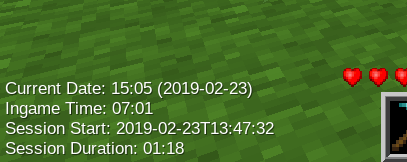
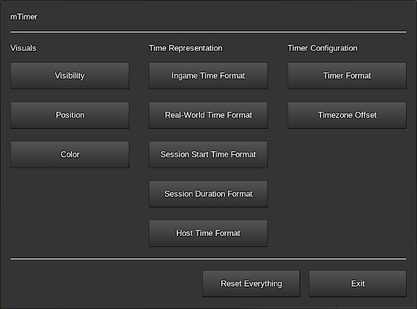
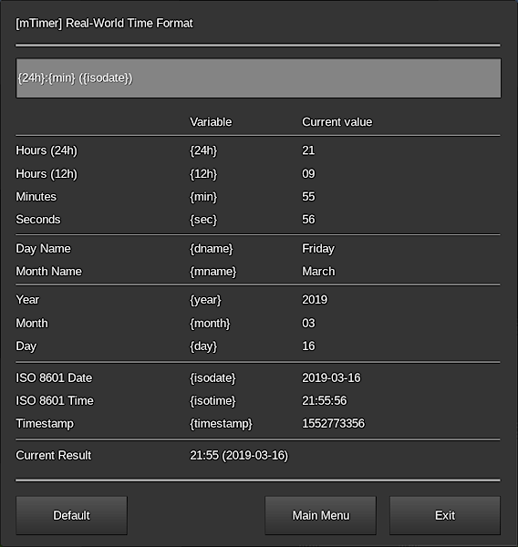
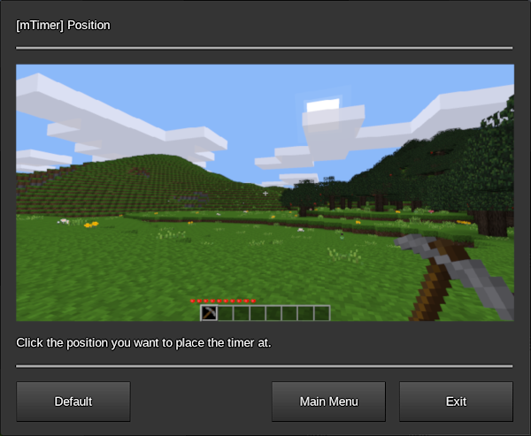
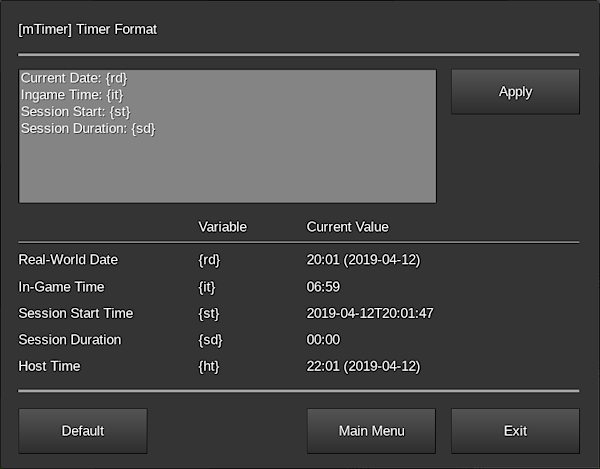

**_mTimer_ is a mod for showing ingame and reallife times and periods**

## Description

*mTimer* is a mod that allows players to individually configure and show a timer as permanent HUD element that automatically updates every second. The timer can show the real-world time and the ingame time as well as the current play session starting time and duration in freely configurable formats.

Use it on your public server to give your players additional value (players can individually hide the timer if they want) while being on your server or use it in your singleplayer world to stay informed or – when creating creative content for others to watch – give your viewers a hint on when the footage was recorded.

## Configuration

The timer display and settings are entirely configured on a per-player basis via configuration formspecs. Configurations are set when leaving the formspec via the buttons or when pressing enter or clicking the apply button (where available). Pressing the escape key cancels the changes.

For opening the main menu simply enter the `/mtimer` chat command. From the main menu all configuration formspecs are accessible.

Simply click the button of the option you want to configure.

Configuration formspecs can be accessed directly by providing the respective parameter to the `/mtimer` chat command. Run `/mtimer help` to see a list of available parameters. You might need to bring up the console (F10 by default) to see all available parameters because the chat display might be too small.

### Variables

Some formspecs allow you to use variables. The variables and their current (i.e. the moment when opening the formspec) values are shown below the input field.

Simply use the variables as shown. For example, to use the day name in the formspec shown above simply enter `{dname}`. Using unknown variables is possible. Those variables are rendered literal. So Entering `{foobar}` renders to “{foobar}” in the output.

Using a string being a variable is not possible (`{foobar}` will always render to it’s value if it is a valid variable). Using the same variable multiple times is possible.

### Confirmations

Pressing enter in an input field applies the changes. Not all formspecs have input fields. Sometimes there only schemes or just buttons.

Using those formspecs is the same except setting things works instantly. So by clicking the bottom right on the scheme in the formspec below directly places the timer there.

Where needed, apply buttons are placed. So instead of having to leave the formspec via the navigation buttons at the bottom to apply the changes simply click the apply button to have the value applied.

In the timer format configuration formspec shown above a text area is used where pressing enter goes to a new line so a button for applying the changes is shown.

## Known Issues

### Formspecs Look Weird

On very small screens the configuration formspecs might look very crammed with text being cut off or overlaying other text. This is due to how formspecs work and is not fixable without massive Minetest engine changes.

Same in the other direction: On very large screens the formspecs seem unnecessary huge with much empty space. Same here: This is not fixable without re-implementing formspec generation from scratch in Minetest.

mTimer was tested with resolutions from 1024×768 up to 2560×1440 with 20px font and GUI scaling of 1.5. Since different font sizes and GUI scaling are somewhat broken in Minetest when it comes to formspecs the later was usable but did not look that good.

### Formspec Language Does Not Match Game Language

Simple: The mod was not translated to the language you’re using. Feel free to translate it and file a pull request. I’d be happy to merge it.

Currently German (`language = de` in `minetest.conf`) and Italian (`language = it`) are supported as translation language and English being the default.
